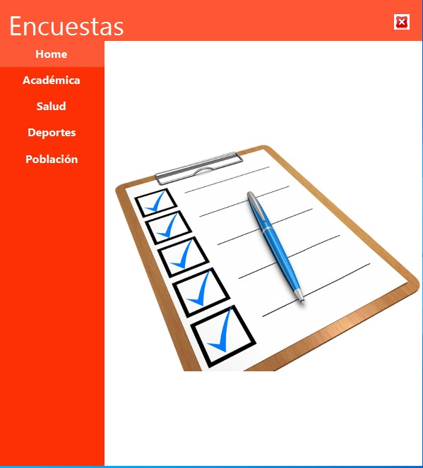
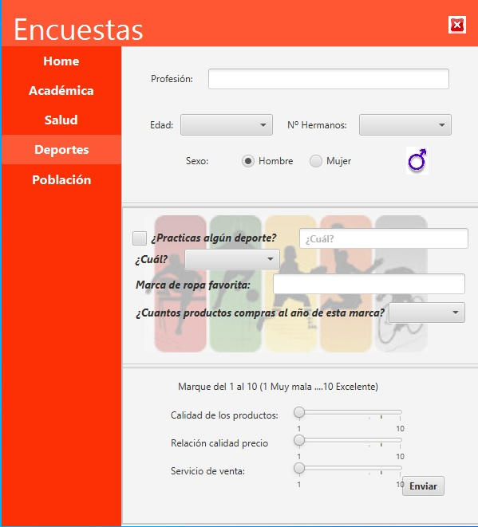

**AppEncuestas\_teamName:**

` `Cada equipo desarrollará una App que permita gestionar las encuestas propuestas. En la imagen de abajo se muestra un ejemplo de implementación con un escenario principal que incluye en un área central una imagen que sugiere encuestas. La imagen muestra el escenario al arrancar la aplicación o al volver al Home desde el menú vertical:

`                                             `imagen\_1
 

El diseño de la aplicación es **LIBRE**, cada equipo podrá elegir su propuesta de diseño. Para realizar las diferentes encuestas sobre las temáticas propuestas, se detallan posibles preguntas a incluir, cada grupo elige las más representativas y que abarquen un mayor número de controles diferentes:

1. **Académica**: Encuesta de universidad para conocer las opiniones y las características de los estudiantes. Posibles preguntas a incluir:
   1. Edad.
   1. Año de inicio de los estudios
   1. Carrera cursada
   1. Número de asignaturas aprobadas
   1. Número de asignaturas cursando en este momento
   1. Horas por semana cursadas
   1. Horas por semana dedicada al estudio
   1. Calificación del nivel de las asignaturas (Marque la opción que considere correcta) Excelente / Muy bueno / Bueno / Regular / Malo / Muy malo.
   1. Participación en algún proyecto de investigación de la universidad ¿En cuál?
   1. ¿Trabaja? ¿Cuántas horas por semana?

1. **Salud**: Encuesta realizada por el Ministerio de Salud para conocer la opinión y el estado de salud de la población.
   1. Fecha de nacimiento.
   1. Lugar de origen.
   1. Lugar de residencia.
   1. ¿Visita al médico todos los años?
   1. Fecha de la última revisión médica
   1. ¿A qué especialistas acude con frecuencia? ¿Cada cuánto tiempo?
   1. ¿Tiene alguna enfermedad crónica? ¿Cuál?
   1. ¿Tiene alguna enfermedad hereditaria? ¿Cuál?
   1. ¿Toma alguna medicación? ¿Cuál?
   1. ¿Está realizando algún tratamiento? ¿Cuál?
   1. ¿Cómo calificaría la asistencia médica que recibe? Excelente / Muy buena / Buena / Regular / Mala / Muy mala.
   1. ¿Siempre concurre al mismo hospital? ¿A cuál? ¿Cómo calificaría la organización de este lugar? Excelente / Muy buena / Buena / Regular / Mala / Muy mala.
   1. ¿Con qué frecuencia acude a urgencias en caso de presentar síntomas de alguna enfermedad? Siempre / Casi siempre / A veces / Casi nunca / Nunca.
   1. ¿Cómo calificaría el trabajo de los profesionales de las urgencias? Excelente / Muy bueno / Bueno / Regular / Malo / Muy malo.
   1. ¿Tiene seguro médico u obra social? Sí / No.
   1. ¿Cómo calificaría el servicio de su seguro médico u obra social? Excelente / Muy bueno / Bueno / Regular / Malo / Muy malo.

1. **Deportes**: Encuesta realizada por una marca deportiva para conocer las preferencias de los consumidores. 
   1. ¿Practicas algún deporte? ¿Cuál?
   1. Marca de ropa favorita
   1. ¿Hay otras marcas que también usa? ¿Cuáles?
   1. ¿Por qué elige una marca? (Por la estética de los productos, Por la calidad de los productos, Por la comodidad que ofrecen los productos, Por el precio, Otros)
   1. ¿Cuántos productos por año compra de esta marca? (Entre uno y cinco, Entre seis y diez, Entre once y quince, Más de quince)
   1. ¿Cómo describiría la calidad de los productos de esa marca? (Excelente, Muy buena, Buena, Regular, Mala, Muy mala)
   1. ¿Cómo describiría la relación precio-calidad de esa marca? (Excelente, Muy buena, Buena, Regular, Mala, Muy mala)
   1. ¿Cada cuánto cambia sus zapatillas deportivas? (Cada seis meses, Cada doce meses, Cada dieciocho meses, Cada veinticuatro meses, Cada tres años, Cada cuatro años, Cada cinco años, Otros)
   1. ¿Qué prenda compra con más frecuencia? (Calzado, Chaquetas, Pantalones, Shorts, Faldas, Vestidos, Playeras, Otros)
   1. ¿Cuánto dinero gasta en prendas deportivas por año? (Menos de 500€, Entre 500€ y 1.000€, Entre 1.000€ y 1500€, Entre 1.500€ y 2.000€, Más de 2.000€)
   1. ¿Cree que las mejores marcas son aquellas más conocidas o que tienen mayor publicidad? (Sí, No, No sé)

1. **Población**: Encuesta realizada por el Estado con el objetivo de conocer las características de la población. 
   1. Edad.
   1. Lugar de nacimiento.
   1. Lugar en el que reside.
   1. ¿Cuántas personas viven en su hogar?
   1. ¿Qué servicios tiene en su hogar? (Agua potable, Electricidad, Gas, Internet, Televisión por cable)
   1. Indique qué dispositivos electrónicos hay en su hogar y la cantidad. (Computadora de escritorio, Computadora portátil, Móvil, Tablet, Televisión)
   1. ¿Cuál es su nivel educativo alcanzado? (Primaria, Secundaria, Bachillerato,  Grado, Posgrado, Ninguno)
   1. Actualmente, ¿está estudiando? ¿en qué nivel? (Primaria, Secundaria, Bachillerato,  Grado, Posgrado, Ninguno)
   1. Actualmente, ¿trabaja? (Si, No)
   1. ¿En qué sector?
   1. ¿Cuántas horas trabaja por semana? (Menos de diez horas, Entre diez y veinte horas,  Entre veinte y treinta horas, Entre treinta y cuarenta horas, Entre cuarenta y cincuenta horas, Más de cincuenta horas)
   1. ¿Realizó algún estudio, curso o capacitación para realizar ese trabajo? (Si, No)
   1. Indique su salario. (Menos de 10.000€, Entre 10.000€ y 15.000€, Entre 15.000€ y 20.000€, Entre 20.000€ y 50.000€, Entre 50.000€ y 100.000€,  Más de 100.000€
   1. ¿Recibe alguna pensión, jubilación o seguro de desempleo? (De ser así, indique el monto en números) (Si, No)

Ejemplo de encuesta al hacer clic sobre de **Deportes**:
 
`						      	`imagen\_2                 

En este ejemplo se han usado los siguientes componentes: 

etiquetas (**Labels**), un campo de texto para la profesión (TextField), para el número de hermanos incluirás una **ChoiceBox** que contendrán los valores: “Ninguno”, “Uno”, “Dos”, “Más de dos”, para la edad otra **ChoiceBox** en la que se deberá elegir entre: “Menos de 15”, “Entre 15 y 18”, “Entre 19 y 35”, “Entre 36 y 60”, “Más de 60”, un **RadioButtons** para el sexo, una **CheckBox** para preguntar al usuario práctica algún deporte, una **ChoiceBox** para los deportes (Tenis, Fútbol, Balonmano, Atletismo y Natación), para las preguntas cerradas tres deslizadores, Sliders. Por último un Button para enviar la encuesta. En cuanto al comportamiento de los **Sliders** muestra en la etiqueta de la derecha el valor correspondiente a la posición seleccionada entre 1 y 10 a medida que el usuario lo desliza. El manejador de selector de sexo, **Toggle**, que mostrará la imagen correspondiente al sexo seleccionado. 

Para cualquier encuesta se deberá programar el manejador de eventos del botón “Enviar” que validará que todos los campos estén rellenos, enviará el **mensaje de error** correspondiente si alguno de los campos no está relleno y por el contrario el mensaje “**Encuesta enviada con éxito**” cuando todo vaya bien. En este último caso **se grabará** la información de la encuesta en un **fichero** llamado **Enc\_Academica.csv**, **Enc\_Salud.csv**, **Enc\_Deportes.csv**, etc., con la fecha y hora del sistema y todos los datos introducidos en una línea. Cada campo de la línea se separará por “;”.
